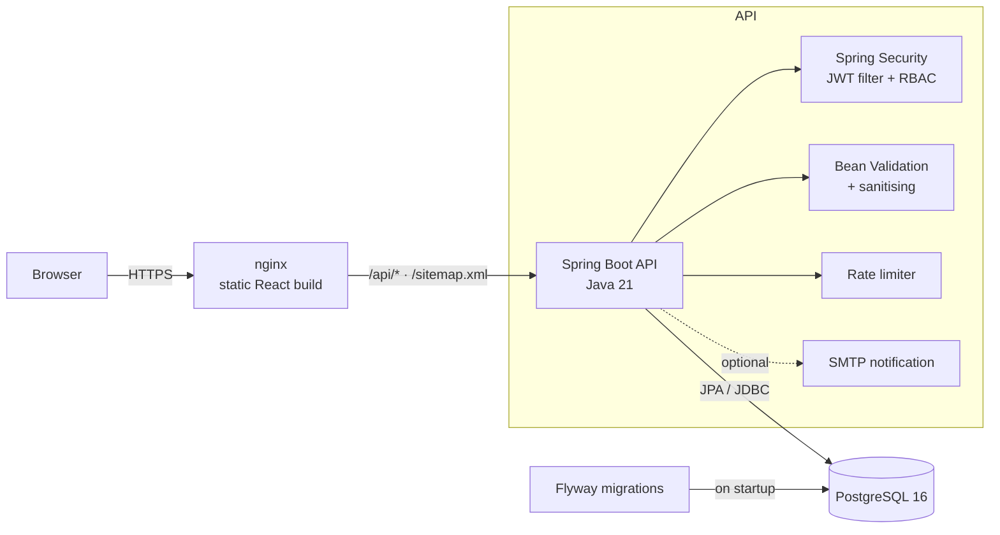

# Rihab Hamdani — Developer Portfolio

A full-stack personal portfolio: a **React + TypeScript** frontend, a **Spring Boot (Java 21)** REST API,
**PostgreSQL** with **Flyway** migrations, **JWT**-protected admin dashboard, first-party analytics,
Docker Compose and GitHub Actions CI.

The portfolio is itself a working product: all content (projects, experience, leadership, skills) comes
from the database through the API, and can be edited from `/admin`.

> Content rule: everything shown on the site comes from information Rihab provided. Unknown details
> (dates, links, screenshots, personal learnings) are left empty and hidden rather than invented.

---

## Contents

- [Architecture](#architecture)
- [Tech stack](#tech-stack)
- [Screenshots](#screenshots)
- [Folder structure](#folder-structure)
- [Quick start (Docker)](#quick-start-docker)
- [Local development without Docker](#local-development-without-docker)
- [Environment variables](#environment-variables)
- [Database](#database)
- [Admin setup](#admin-setup)
- [Authentication & security](#authentication--security)
- [API documentation](#api-documentation)
- [Analytics](#analytics)
- [Testing](#testing)
- [CI/CD](#cicd)
- [Production deployment](#production-deployment)
- [Files you still need to add](#files-you-still-need-to-add)
- [Future improvements](#future-improvements)

---

## Architecture



Request path inside the backend:

```
JWT filter → Controller (Bean Validation) → Service (business rules, rate limiting)
          → Repository (Spring Data JPA) → PostgreSQL
Errors → GlobalExceptionHandler → structured JSON { status, message, fieldErrors, path }
```

In Docker, nginx serves the frontend **and** proxies `/api` to the backend, so the browser only talks to
one origin (no CORS in production). In development, Vite does the same proxying.

## Tech stack

| Layer          | Technologies                                                                                   |
| -------------- | ---------------------------------------------------------------------------------------------- |
| Frontend       | React 18, TypeScript, Vite 6, Tailwind CSS 3, Framer Motion, React Router 6, TanStack Query 5, Axios, Lucide |
| Backend        | Java 21, Spring Boot 3.5, Spring Web, Spring Security, JWT (jjwt), Spring Data JPA, Bean Validation, Lombok |
| Database       | PostgreSQL 16, Flyway                                                                           |
| Tests          | Vitest + Testing Library (frontend) · JUnit 5, Mockito, MockMvc, Testcontainers (backend)        |
| Infrastructure | Docker, Docker Compose, nginx, GitHub Actions                                                   |

## Screenshots

Screenshots are not committed yet. After running the project, capture the home page (dark and light), a
case study and the admin dashboard, then add them to `docs/screenshots/` and reference them here.

## Folder structure

```text
rihab-portfolio/
├── backend/                         Spring Boot API
│   ├── pom.xml
│   ├── Dockerfile
│   └── src/
│       ├── main/java/com/rihab/portfolio/
│       │   ├── config/              properties, admin seeder, beans
│       │   ├── controller/          public controllers (+ admin/ for protected ones)
│       │   ├── dto/                 request/response records
│       │   ├── entity/              JPA entities
│       │   ├── exception/           structured errors + global handler
│       │   ├── repository/          Spring Data repositories (+ analytics native queries)
│       │   ├── security/            JWT service, filter, security config
│       │   ├── service/             business logic, rate limiter
│       │   ├── util/                input sanitiser, client IP resolver
│       │   └── PortfolioApplication.java
│       ├── main/resources/
│       │   ├── application.yml
│       │   └── db/migration/        V1__init_schema.sql, V2__seed_initial_content.sql
│       └── test/                    unit, controller, security and integration tests
├── frontend/                        React application
│   ├── Dockerfile · nginx.conf
│   ├── public/                      favicon, OG image, images/, projects/, CV location
│   └── src/
│       ├── api/                     axios client, endpoints, query client
│       ├── animations/              Framer Motion variants
│       ├── components/              UI primitives, admin widgets, playground, icons
│       ├── config/                  site configuration from env vars
│       ├── context/                 theme, auth, toasts
│       ├── hooks/                   data hooks, analytics, SEO meta, active section …
│       ├── layouts/                 public + admin layouts
│       ├── pages/                   home, case study, 404, admin pages
│       ├── sections/                homepage sections
│       ├── test/                    Vitest tests
│       ├── types/ · utils/
│       └── App.tsx · main.tsx
├── database/README.md               schema notes (migrations live in backend/)
├── docker-compose.yml
├── .env.example
└── .github/workflows/ci.yml
```

## Quick start (Docker)

Requirements: **Docker** with Docker Compose v2.

```bash
git clone <your-repo-url> rihab-portfolio
cd rihab-portfolio
cp .env.example .env
```

Edit `.env` and set at least:

```env
JWT_SECRET=<output of: openssl rand -base64 48>
ADMIN_EMAIL=you@example.com
ADMIN_PASSWORD=<at least 12 characters>
POSTGRES_PASSWORD=<any local password>
```

Then:

```bash
docker compose up --build
```

| URL                                     | What                        |
| --------------------------------------- | --------------------------- |
| http://localhost:3000                   | Portfolio                   |
| http://localhost:3000/admin             | Admin dashboard             |
| http://localhost:8080/actuator/health   | Backend health (local only) |

Startup order is enforced with health checks: PostgreSQL → backend (Flyway runs, admin is created) → frontend.

Stop with `Ctrl+C`; `docker compose down` removes containers, `docker compose down -v` also deletes the database volume.

## Local development without Docker

Requirements: **Node.js 20.19+ (22 recommended)**, **Java 21**, **Maven 3.9+**, and PostgreSQL 16
(either installed locally or started with Docker).

### 1. Database

```bash
# Option A — only the database from docker compose
docker compose up -d postgres

# Option B — your own PostgreSQL
createdb portfolio   # and create a user matching DB_USERNAME / DB_PASSWORD
```

### 2. Backend

```bash
cd backend
set -a; source ../.env; set +a        # load JWT_SECRET, ADMIN_*, POSTGRES_* …
export DB_URL=jdbc:postgresql://localhost:5432/${POSTGRES_DB:-portfolio}
export DB_USERNAME=${POSTGRES_USER:-portfolio} DB_PASSWORD=$POSTGRES_PASSWORD
mvn spring-boot:run
```

On Windows PowerShell, set the same variables with `$env:NAME="value"` before `mvn spring-boot:run`,
or add them to the run configuration in IntelliJ IDEA.

The API starts on http://localhost:8080. Flyway creates the schema and seeds the content on first start.

### 3. Frontend

```bash
cd frontend
npm install
cp .env.example .env.local           # optional: social links, site URL
npm run dev
```

Open http://localhost:5173. Vite proxies `/api` and `/sitemap.xml` to `http://localhost:8080`
(change with `VITE_DEV_API_PROXY`).

## Environment variables

Root `.env` (used by Docker Compose; also handy for local runs):

| Variable | Required | Description |
| --- | --- | --- |
| `POSTGRES_DB` / `POSTGRES_USER` | no | Database name and user (default `portfolio`). |
| `POSTGRES_PASSWORD` | **yes** | Database password. |
| `POSTGRES_PORT` | no | Host port for PostgreSQL (bound to 127.0.0.1). |
| `JWT_SECRET` | **yes** | HMAC key for signing JWTs, ≥ 32 characters. The backend refuses to start without it. |
| `JWT_EXPIRATION_MINUTES` | no | Token lifetime (default 120). |
| `ADMIN_EMAIL` / `ADMIN_PASSWORD` | first run | Creates the admin account on startup if it doesn't exist. Password ≥ 12 characters. |
| `ADMIN_DISPLAY_NAME` | no | Name shown in the dashboard. |
| `CORS_ALLOWED_ORIGINS` | no | Comma-separated origins allowed to call the API directly. |
| `SITE_URL` | recommended in prod | Public URL, e.g. `https://example.dev`. Used for canonical URLs, OG tags, robots.txt and the sitemap. |
| `VITE_GITHUB_URL` / `VITE_LINKEDIN_URL` / `VITE_EMAIL` | no | Your links. Empty values are hidden on the site. |
| `VITE_RESUME_URL` | no | Where the CV PDF lives (default `/Rihab-Hamdani-CV.pdf`). |
| `VITE_PROFILE_PHOTO` | no | Profile photo path (default `/images/profile.jpg`). |
| `RATE_LIMIT_CONTACT_PER_HOUR` | no | Contact submissions per IP per hour (default 5). |
| `RATE_LIMIT_LOGIN_PER_15_MIN` | no | Login attempts per IP per 15 minutes (default 10). |
| `RATE_LIMIT_ANALYTICS_PER_MIN` | no | Analytics events per IP per minute (default 60). |
| `MAIL_ENABLED` + `MAIL_HOST`, `MAIL_PORT`, `MAIL_USERNAME`, `MAIL_PASSWORD`, `MAIL_FROM`, `MAIL_TO` | no | Optional e-mail notification for new contact messages. Messages are always stored in the database first. |
| `FRONTEND_PORT` / `BACKEND_PORT` | no | Host ports (defaults 3000 / 8080). |

Backend-only variables (set by Compose, or by you when running `mvn spring-boot:run`):
`DB_URL`, `DB_USERNAME`, `DB_PASSWORD`, `SERVER_PORT`, `TRUST_FORWARDED_HEADERS` (set `true` only behind
a reverse proxy you control, so client IPs for rate limiting can't be spoofed).

> `VITE_*` values are **public**: they are compiled into the JavaScript bundle. Never put secrets in them.
> Changing them requires rebuilding the frontend (`docker compose up --build frontend`).

## Database

See [`database/README.md`](database/README.md) for the full schema diagram.

- Migrations: `backend/src/main/resources/db/migration/`
  - `V1__init_schema.sql` — tables, UUID primary keys, foreign keys, unique and check constraints, indexes
  - `V2__seed_initial_content.sql` — the initial projects, experience, leadership roles and skills
- Hibernate never modifies the schema (`ddl-auto: none`); Flyway is the single source of truth.
- Tables: `users`, `projects`, `technologies`, `project_technologies`, `experiences`, `leadership_roles`,
  `skills`, `contact_messages`, `analytics_events`.

## Admin setup

1. Set `ADMIN_EMAIL` and `ADMIN_PASSWORD` (≥ 12 characters) in `.env`.
2. Start the backend. On startup, if no user with that e-mail exists, it is created with a BCrypt hash.
   The log shows `Admin account created for …`.
3. Sign in at `/admin`.
4. Optional: remove `ADMIN_PASSWORD` from `.env` afterwards. The account stays in the database.

To reset the password, delete the user and restart with new values:

```bash
docker compose exec postgres psql -U portfolio -d portfolio -c "delete from users where email = 'you@example.com'"
docker compose restart backend
```

The dashboard lets you manage **projects** (create, edit, delete, publish/unpublish, reorder, screenshots),
**experience**, **leadership**, **skills**, read and archive **messages**, and view **analytics**.

## Authentication & security

- `POST /api/auth/login` checks the BCrypt (cost 12) hash and returns an HS256 JWT (`sub` = user id,
  `role`, `iss`, `exp`). Unknown e-mails take the same time as wrong passwords.
- A JWT filter validates the signature, issuer and expiry, then **reloads the user on every request**, so a
  disabled or deleted admin loses access immediately.
- `/api/admin/**` requires `ROLE_ADMIN` (URL rule + `@PreAuthorize` on each admin controller).
- Stateless sessions, CSRF disabled (no cookies are used), strict CORS allow-list.
- Rate limiting: login (brute force), contact form and analytics, keyed by client IP. IPs are never stored.
- Contact form: Bean Validation, HTML/control-character stripping, a honeypot field for bots, length limits
  enforced in both the API and the database.
- Structured JSON errors for 400/401/403/404/409/429/500. No stack traces or internal messages are returned.
- Security headers: `X-Content-Type-Options`, `X-Frame-Options: DENY`, `Referrer-Policy`, CSP on the API
  and on nginx.
- Secrets only come from environment variables; `.env` is git-ignored; no credentials in migrations.
- In the browser, the JWT lives in `sessionStorage` (cleared when the browser closes) and is only sent to
  `/api/admin/**` and `/api/auth/me`.

## API documentation

All responses are JSON. Errors use this shape:

```json
{ "timestamp": "…", "status": 400, "error": "Bad Request", "message": "Some fields are invalid.",
  "path": "/api/contact", "fieldErrors": { "email": "Please enter a valid email address." } }
```

### Public

| Method | Path | Description |
| --- | --- | --- |
| GET | `/api/projects` | Published projects, ordered. |
| GET | `/api/projects/{slug}` | One published case study (404 if missing or unpublished). |
| GET | `/api/experience` | Experience timeline. |
| GET | `/api/leadership` | Leadership roles. |
| GET | `/api/skills` | Skills with category, description, icon. |
| POST | `/api/contact` | `{ name, email, subject, message }` → `201`. Validated, sanitised, rate-limited. |
| POST | `/api/analytics/events` | `{ eventType, page?, projectSlug?, metadata? }` → `202`. |
| POST | `/api/auth/login` | `{ email, password }` → `{ token, expiresAt, user }`. |
| GET | `/sitemap.xml` | Sitemap generated from published projects. |
| GET | `/actuator/health` | Health check. |

### Authenticated (`Authorization: Bearer <token>`, role ADMIN)

| Method | Path | Description |
| --- | --- | --- |
| GET | `/api/auth/me` | Current user. |
| GET | `/api/admin/overview` | Counts for the dashboard. |
| GET / POST | `/api/admin/projects` | List all (incl. drafts) / create. |
| GET / PUT / DELETE | `/api/admin/projects/{id}` | Read / update / delete. |
| PATCH | `/api/admin/projects/{id}/publish` | `{ published: boolean }` |
| PUT | `/api/admin/projects/order` | `{ ids: [uuid…] }` — full ordered list. |
| GET / POST | `/api/admin/experience` | List / create. |
| PUT / DELETE | `/api/admin/experience/{id}` | Update / delete. |
| GET / POST | `/api/admin/leadership` | List / create. |
| PUT / DELETE | `/api/admin/leadership/{id}` | Update / delete. |
| GET / POST | `/api/admin/skills` | List / create. |
| PUT / DELETE | `/api/admin/skills/{id}` | Update / delete. |
| GET | `/api/admin/messages?status=&page=&size=` | Paginated messages. |
| PATCH / DELETE | `/api/admin/messages/{id}` | `{ status: NEW \| READ \| ARCHIVED }` / delete. |
| GET | `/api/admin/analytics/summary?days=30` | Totals by type, per day, top projects, top pages. |

Example:

```bash
TOKEN=$(curl -s -X POST localhost:8080/api/auth/login -H 'Content-Type: application/json' \
  -d '{"email":"you@example.com","password":"your-password"}' | jq -r .token)
curl -s localhost:8080/api/admin/overview -H "Authorization: Bearer $TOKEN"
```

A [Bruno](https://www.usebruno.com/) or Postman collection can be created from these tables.

## Analytics

Tracked events: `page_view`, `project_view`, `resume_download`, `contact_submit`, `github_click`,
`linkedin_click`. Stored fields: `event_type`, `page` (path only, query string removed), `project_id`,
`metadata`, `occurred_at`.

- First-party, no cookies, no IP addresses, no third-party scripts. The browser's *Do Not Track* setting is respected.
- The dashboard only shows real stored events. With no events it shows **"No analytics data yet."**

## Testing

```bash
# Frontend — Vitest + Testing Library
cd frontend && npm test

# Backend — JUnit 5 / Mockito / MockMvc (+ Testcontainers)
cd backend && mvn verify
```

Frontend tests (`frontend/src/test/`): contact form validation, success and backend-error states, API error
normalisation (400/429/5xx/network), project card rendering, projects section loading from the API with
empty and error states, admin route protection, analytics empty state.

Backend tests (`backend/src/test/`):

- `JwtServiceTest` — issuing, expiry, tampering, wrong key, wrong issuer, weak secret.
- `AuthServiceTest` — valid login, wrong password, unknown e-mail, disabled account, brute-force limit.
- `ContactServiceTest` / `InputSanitizerTest` — sanitising, honeypot, rate limiting.
- `ProjectServiceTest` — retrieval, 404, duplicate slug, technology de-duplication, reordering.
- `RateLimiterTest` — limits, independent keys, window reset, eviction.
- `PublicApiControllerTest` — project retrieval, 404/500 JSON, contact validation (400), 429, analytics.
- `AuthAndAdminSecurityTest` — login 200/401/400, admin endpoints reject anonymous and invalid tokens,
  accept a valid admin token, disabled users lose access, CORS allow-list.
- `PortfolioIntegrationTest` — **Testcontainers + real PostgreSQL**: Flyway migrations, seed content, drafts
  hidden, sitemap, admin login, contact storage, project update, analytics. Skipped automatically if Docker
  is not available on your machine; it always runs in CI.

## CI/CD

`.github/workflows/ci.yml` runs on every push to `main` and on pull requests:

```
Checkout → Install dependencies → Frontend build (tsc + vite) → Frontend tests
         → Backend build → Backend tests (incl. Testcontainers) → Docker build (both images) + compose validation
```

Any failing build or test fails the pipeline. Images are built but not pushed. Add a registry login and
`push: true` when you choose a host.

## Production deployment

The stack is three containers, so any host that runs Docker works.

**Option 1: one VPS with Docker Compose** (simplest; e.g. Hetzner, DigitalOcean, OVH)

1. Install Docker, clone the repo, create `.env` with strong values and `SITE_URL=https://your-domain`.
2. `docker compose up -d --build`
3. Put a TLS-terminating reverse proxy in front of port 3000 (Caddy, Traefik, or nginx + Let's Encrypt).
4. Back up the `postgres-data` volume (`pg_dump` on a schedule).

**Option 2: managed services**

- Frontend: build with `npm run build` and host `frontend/dist` on Vercel / Netlify / Cloudflare Pages.
  Configure a rewrite of `/api/*` and `/sitemap.xml` to the backend URL, or build with
  `VITE_API_URL=https://api.your-domain/api` and add the frontend origin to `CORS_ALLOWED_ORIGINS`.
- Backend: deploy `backend/Dockerfile` to Render, Railway, Fly.io or Azure Container Apps.
- Database: a managed PostgreSQL (Neon, Supabase, Render, RDS). Set `DB_URL`, `DB_USERNAME`, `DB_PASSWORD`.

Production checklist: unique `JWT_SECRET` and database password, `SITE_URL` set, HTTPS only,
`TRUST_FORWARDED_HEADERS=true` only if the proxy overwrites `X-Forwarded-For`, admin password rotated
after the first login, database backups.

> The rate limiter is in-memory and therefore per instance. For several backend instances, move it to a
> shared store (e.g. Redis).

## Files you still need to add

| File | Where | Notes |
| --- | --- | --- |
| CV (PDF) | `frontend/public/Rihab-Hamdani-CV.pdf` | Until it exists, "Download Resume" tells visitors it's not available yet. |
| Profile photo | `frontend/public/images/profile.jpg` | Square, ≥ 800 px, < 200 KB. Until then a styled "rh" monogram is shown. |
| Project screenshots | `frontend/public/projects/<slug>/…` | Then add them per project in Admin → Projects → Edit → Screenshots. |
| Social links | `.env` → `VITE_GITHUB_URL`, `VITE_LINKEDIN_URL`, `VITE_EMAIL` | Hidden until set. |

Content to complete from the admin dashboard (left empty on purpose):

- MajraDeep internship **period**, and the TRY IT role **period**.
- **"What I learned"** for each project, in your own words.
- **GitHub / demo links** per project.
- **StudyMate AI** status label.
- **SmartCabinet**: it is seeded as an unpublished draft. Add verified details and screenshots from the
  SmartCabinet PDF, then publish it.

## Future improvements

- Image upload from the admin dashboard (object storage) instead of files in `public/`.
- Redis-backed rate limiting for multi-instance deployments.
- Refresh tokens / HttpOnly cookie sessions for the admin.
- OpenAPI (springdoc) documentation page.
- Pre-rendering of public pages for even faster first paint and richer link previews.
- End-to-end tests with Playwright in CI.
