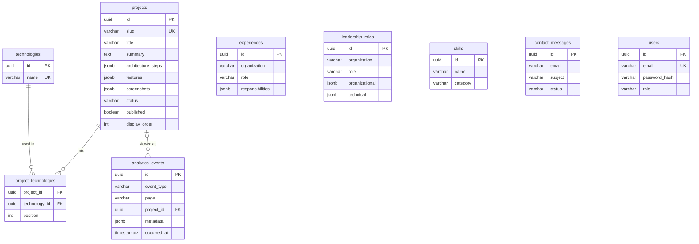

# Database

PostgreSQL 16, schema managed by **Flyway**.

The migrations live with the backend so Spring Boot runs them automatically on startup:

```
backend/src/main/resources/db/migration/
├── V1__init_schema.sql          # tables, keys, constraints, indexes
└── V2__seed_initial_content.sql # initial portfolio content (no credentials)
```

Rules:

- Never edit a migration that has already run. Add a new one (`V3__...sql`) instead.
- No passwords or secrets in migrations — the admin account is created at runtime from
  `ADMIN_EMAIL` / `ADMIN_PASSWORD`.
- Content (projects, skills, …) is meant to be edited from the admin dashboard after the first start.

## Schema



## Useful commands

```bash
# Open a psql shell in the Docker database
docker compose exec postgres psql -U portfolio -d portfolio

# See which migrations ran
docker compose exec postgres psql -U portfolio -d portfolio -c "select version, description, success from flyway_schema_history"
```
